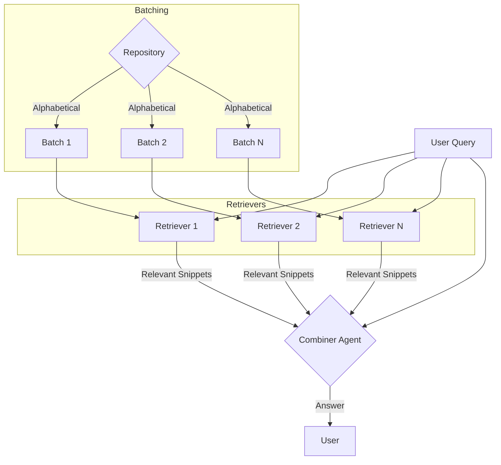
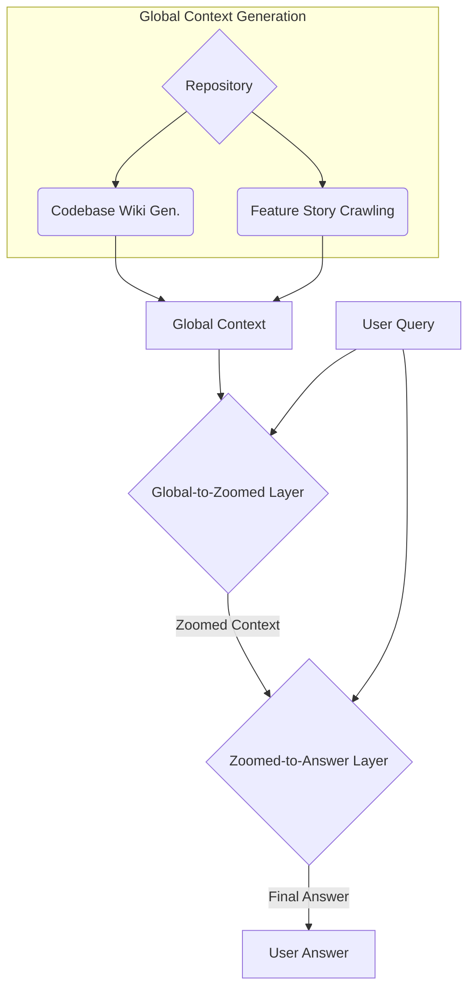

# Atlas Ask - Meeting Notes & Reflections (Chris & [Your Name])

## Current System Overview

Atlas Ask is a code/team understanding tool leveraging long-context AI. Its current architecture involves two main components:

1.  **Retriever Agents:**
    - The code repository is arbitrarily divided into batches based on alphabetical file order.
    - Each Retriever agent processes one batch within its token limit.
    - A user query is appended to the batch context.
    - The agent identifies relevant code segments from its batch to pass on.
2.  **Combiner Agent:**
    - Receives relevant segments from multiple Retriever agents.
    - Synthesizes the information to answer the user's query.
    - Can theoretically access any file but relies heavily on Retriever output for guidance.

## Identified Flaws & Core Problem

- **Arbitrary Batching:** The alphabetical splitting of the codebase is arbitrary and doesn't align with logical code structures or relevance to potential queries.
- **Retriever Omission Bias:**
  - Retrievers tend to output within a specific token range, regardless of the amount of relevant information in their batch.
  - If a Retriever receives a disproportionate amount of relevant files (due to arbitrary batching), it's likely to **omit** significant portions of relevant context simply to meet its implicit output token target.
- **Criticality of Omission:**
  - The decision of what _not_ to show the Combiner is the most critical, high-stakes decision in the current system.
  - Omissions are largely irreversible; the Combiner is unlikely to find information not surfaced by a Retriever.
  - In contrast, the Combiner can easily ignore _irrelevant_ information passed to it.
  - **Conclusion:** The system should err on the side of over-including potentially relevant information for the Combiner, rather than over-excluding it at the Retriever level.

## Proposed Solution: Top-Down Context Conditioning

The core idea is to make the critical decision of **what to omit** based on the **broadest possible context** early in the process. Since the entire codebase + auxiliary info exceeds context limits, this requires viewing the information at a lower resolution or "squinting."

- **Mechanism:** Condition the exclusion/inclusion process on a "global context" or low-resolution summary of the entire relevant information space.
- **Goal:** Ensure that the initial, broad filtering is maximally informed.

### Examples of Global Context Generation:

1.  **Codebase Wiki:** Generate a detailed wiki (like Devin) describing components, functionality, and interconnections.
2.  **Feature Story Crawling:** Automatically crawl the codebase starting from entry points (executables, exports) to map out "stories" or workflows (e.g., "request handling," "data processing pipeline").

### Possible Architectures:

1.  **Global-to-Zoomed Layer:** An initial agent uses the "global context" to identify and potentially exclude large swathes of irrelevant information, producing a "zoomed-in" but still potentially large context.
2.  **Zoomed-to-Answer Layer:** A subsequent agent takes the zoomed context, performs finer-grained analysis and exclusion, and generates the final answer.
3.  **Alternative Diamond Architecture (Chris's Idea):** Instead of distinct top-down layers, the global context could directly inform the individual, low-level Retriever agents. These agents would then perform initial filtering/retrieval, and their outputs would bubble up, potentially through intermediate aggregation/summarization steps, eventually converging at the final Answer agent. This represents a 'diamond' flow: broad context -> distributed initial processing -> consolidation -> final answer.

## Structure vs. Flexibility

A key discussion point was balancing structured information flow with the need for agents to pursue information _agentically_ and flexibly.

- **Need for Structure:** Ensures systematic coverage and processing.
- **Need for Flexibility:** Allows agents to dynamically pursue information based on intermediate findings (one piece of info informs the need for another). Prevents agents from hallucinating or giving qualified answers due to missing context they couldn't seek out.

## Claude Code as an "Ideal Form Factor"?

We evaluated whether the approach used by tools like Claude Code represents an ideal for Atlas Ask.

- **Pros:** Empirically strong performance.
- **Cons:**
  - **Slow Start:** Starts from scratch each time.
  - **Runtime Bias:** May prematurely return answers without deep exploration of large codebases.
  - **No Context Pruning:** Cannot excise irrelevant information from its context window once added.
- **Implication:** The final context in Claude Code often contains significant noise that displaces potentially more relevant information. This reinforces the idea that **context is limited real estate** requiring careful management.

## Post-Meeting Reflections

- **Top-Down vs. Bottom-Up:** These approaches might not be mutually exclusive. A hybrid system could potentially leverage the strengths of both concurrently.
- **Core Principle:** The decision to **exclude** information must always be careful, deliberate, and conditioned on the best available information _at the time the decision is made_.
- **Exclusion Strategies:**
  - **Invert Retriever Task:** Ask Retrievers to name files/sections to _exclude_ rather than include. (Problem: Still risks context explosion if not combined with other methods).
  - **Top-Down Exclusion:** A global-context agent excludes files, directories, or glob patterns.
  - **Combined Exclusion:** Exclude the _union_ of files identified for exclusion by both top-down and bottom-up (Retriever) agents.
  - **Multi-Level Exclusion:** If combined exclusion still yields too large a context, present a "skeleton" (e.g., file names, function signatures) of the remaining candidates to an agent and ask it to exclude specific _functions_ or smaller code units.
- **Flexible, Multi-Agent Approach (Most Advanced):**
  - Initiate multiple agents concurrently, each conditioned on different slices/granularities of code.
  - Allow agents to agentically choose actions:
    - `exclude(item)`
    - `zoom_and_exclude(item)`: Focus on a subset and repeat exclusion.
    - `include_and_exclude(item)`: Bring in new related context, then trigger exclusion.
  - **Resource Management:** Potentially provide agents with explicit token/character targets for exclusion (e.g., "You need to exclude 10k more characters to include file X"). Implement retry mechanisms if exclusion targets aren't met.
