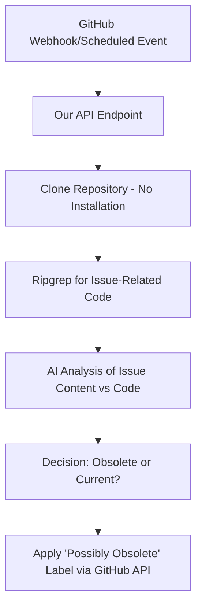
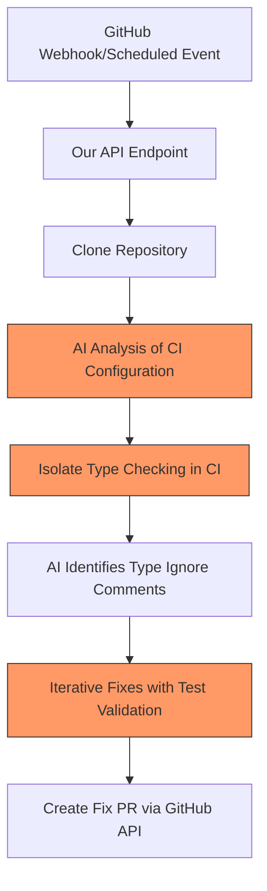

# AI-Powered GitHub Tooling

## From Research to Modular, Scalable Products

---

# Our Technical Opportunity

<v-clicks>

- Enterprise customers seek focused, reliable workflows
- Our current approach requires high-touch, customized solutions
- Large competitors have advantages in enterprise relationships
- We need to leverage our AI research in productized, scalable ways

</v-clicks>

---

# The Open-Source Strategy

<v-clicks>

- No robust suite of plug-and-play AI-powered GitHub tooling exists yet
- Open-source adoption provides:
  - Broad visibility and adoption
  - Data acquisition for specialized training
  - Battle-tested, production-ready code
  - Forcing function for modular, scalable design

</v-clicks>

---

# Technical Insight: Repo-Agnostic Workflows

<v-clicks>

- All we need per workflow is:
  - GitHub repo URL
  - Commit hash
  - Workflow-specific parameters (e.g., issue ID, PR number)
- Same infrastructure handles diverse repositories
- No per-customer implementation required

</v-clicks>

---

## layout: statement

# Workflow Implementation Deep Dive

---

# Example 1: Obsolete Issue Identifier

### Read-Only Workflow

---

# Implementation: Obsolete Issue Identifier



---

# Technical Details: Obsolete Issue Workflow

<!-- This doesn't add anything above the mermaid graph -->

<div class="grid grid-cols-2 gap-4">
<div>

### Endpoint Implementation

```python
def obsolete_issue_handler(repo_url, issue_id):
    # 1. Clone repo to temp dir (shallow)
    repo_path = clone_repo(repo_url, shallow=True)

    # 2. Extract issue content via GitHub API
    issue_data = get_issue_data(repo_url, issue_id)

    # 3. Use ripgrep to find relevant code
    code_snippets = search_relevant_code(
        repo_path, issue_data['keywords'])

    # 4. AI evaluation
    is_obsolete = ai_evaluate_obsolescence(
        issue_data, code_snippets)

    # 5. Apply label if obsolete
    if is_obsolete:
        apply_label(repo_url, issue_id, "possibly-obsolete")
```

</div>
<div>

### Integration Options

- **GitHub Action**: Triggered periodically
- **GitHub App**: Processes webhooks
- **Scheduled Job**: Runs checks on predefined intervals

### Advantages

- No execution of repo code
- No installation requirements
- Fast and safe execution
- Easily parallelizable
- Works on any repository

</div>
</div>

---

# Implementation Variations

<v-clicks>

- **Time-Based Detection**: Check issues inactive for X months
- **Code Evolution Detection**: Compare issue descriptions against code changes since created
- **Automatic Comment**: Generate detailed explanation of why issue appears obsolete
- **Human-in-Loop Option**: Suggest obsolescence to maintainers rather than direct labeling

</v-clicks>

---

## layout: statement

# Example 2: Type Safety Improvement

### Test-Running Workflow

---

# Implementation: Type Safety Improvement



---

# Technical Details: Type Safety Workflow

<div class="grid grid-cols-2 gap-4">
<div>

### CI Isolation Process

```python
def isolate_type_checking(ci_config):
    # AI prompt to identify relevant type-checking parts
    type_check_config = ai_isolate_type_checking(ci_config)

    # Create modified CI that only runs type checking
    modified_ci = create_focused_ci(
        ci_config, type_check_config)

    # Write modified CI to repo
    write_temp_ci_config(modified_ci)

    return modified_ci
```

</div>
<div>

### Iterative Fix Process

```python
def fix_type_ignores(repo_path, modified_ci):
    # Find all type ignore comments
    ignores = find_type_ignores(repo_path)

    # Group by file for efficient fixing
    grouped_ignores = group_by_file(ignores)

    for file, file_ignores in grouped_ignores.items():
        # Create AI-generated fixes
        fixed_file = ai_fix_type_issues(file, file_ignores)

        # Write fixed file
        write_file(file, fixed_file)

        # Validate with act using modified CI
        if not validate_with_act(modified_ci):
            # Revert changes if validation fails
            revert_file(file)
```

</div>
</div>

---

# Key Technical Innovation

<v-clicks>

- **AI-Driven CI Modification**:

  - Analyze CI configuration files (.github/workflows, etc.)
  - Identify type-checking steps
  - Create simplified CI that only runs relevant checks
  - Dramatically reduces execution time and complexity

- **Validation Without Full Installation**:
  - Use Act tool to simulate GitHub Actions locally
  - Run only the necessary subset of CI
  - Verify fixes without complete dependency installation

</v-clicks>

---

# Connecting Research to Product

<v-clicks>

- All workflow executions routed through our Machina inference system
- Input/output messages stored in Sequence Storage
- Success signals (PR merged, issue closed) captured
- This data enables RL training on specific workflows
- Our current online RL training pipeline supports this approach

</v-clicks>

---

# Generalizing the Pattern

<div class="grid grid-cols-2 gap-4">
<div>

### Read-Only Workflows

- Issue triage/labeling
- PR style compliance checking
- Documentation gap analysis
- Security vulnerability scanning
- No CI execution needed
- Fast, secure execution

</div>
<div>

### Test-Running Workflows

- Type safety improvements
- Dependency updates
- Test coverage improvements
- Code style standardization
- Focused CI execution
- Validatable changes

</div>
</div>

---

# Technical Requirements

<v-clicks>

- **Core Infrastructure**:

  - GitHub App/Action framework
  - Secure repository cloning service
  - Act-based CI simulation environment
  - AI inference endpoint with routing to Machina

- **Engineering Resources**:
  - Backend engineers for workflow implementation
  - ML engineers for specialized model training
  - DevOps for CI integration infrastructure

</v-clicks>

---

# From Bespoke to Modular

<v-clicks>

- **Current Approach**: Custom implementation per client repository
- **New Approach**: Single implementation works across all repositories
- **Key Difference**: CI-driven configuration and validation
- **Result**: Scalable product instead of consulting service

</v-clicks>

---

# Implementation Timeline

<v-clicks>

- **1 Month**: Infrastructure setup

  - GitHub App foundation
  - Repository cloning service
  - Act-based CI simulation

- **2 Months**: First two workflows

  - Obsolete issue identifier
  - Type safety improvement (basic)

- **4 Months**: Expanded workflows and data collection
  - Machina integration complete
  - First specialized model training begins

</v-clicks>

---

## layout: statement

# Questions?
