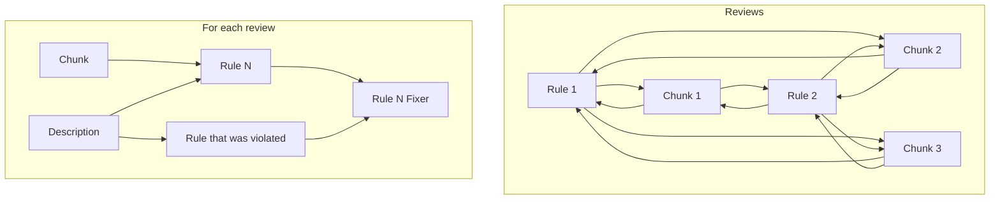

```mermaid
graph TD
subgraph Reviews
Rule1[Rule 1] --> Chunk1[Chunk 1]
Rule1 --> Chunk2[Chunk 2]
Rule1 --> Chunk3[Chunk 3]

        Rule2[Rule 2] --> Chunk1
        Rule2 --> Chunk2
        Rule2 --> Chunk3

        Chunk1 --> Rule1
        Chunk2 --> Rule1
        Chunk3 --> Rule1

        Chunk1 --> Rule2
        Chunk2 --> Rule2
        Chunk3 --> Rule2
    end

    subgraph "For each review"
        C[Chunk] --> RN[Rule N]
        D[Description] --> RN
        D --> RuleN[Rule that was violated]
        RuleN --> RNF[Rule N Fixer]
        RN --> RNF
    end
```
