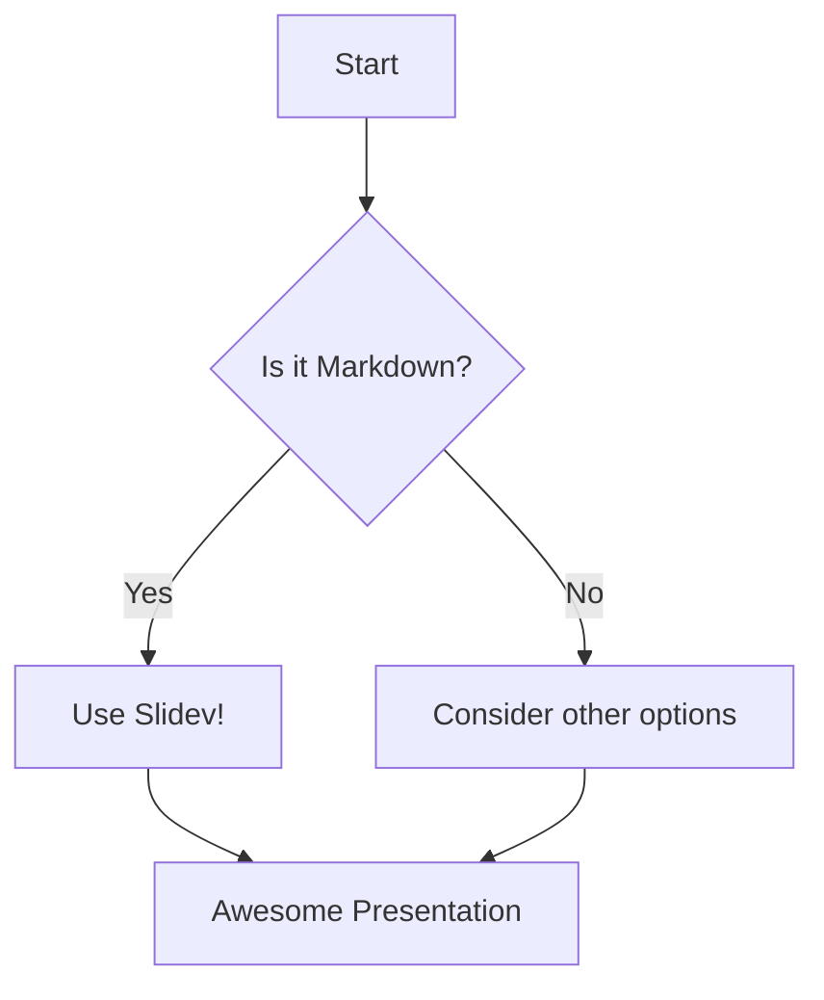

# Slide 1: Welcome

This is the first slide using Slidev.

It supports standard Markdown and interactive components.

---

layout: image-right # Use a layout with an image placeholder
image: https://via.placeholder.com/400x300/09f/fff.png?text=Slidev+Layout

---

# Slide 2: Layouts & Code

This slide uses the `image-right` layout.

Slidev offers multiple built-in layouts and easy customization.

```python {all|1|2|3}
import antigravity

def fly():
  antigravity.fly() # Note the syntax highlighting and line focus!
```

<!-- Presenter notes for Slide 2: Explain how layouts work -->

---

# Slide 3: Animations

Slidev supports step-by-step animations with `v-click`:

- This appears first.
  <v-click>
  - This appears after the first click.
    </v-click>
    <v-click>
  - And this appears last.
    </v-click>

<!--
Note: We apply v-click *around* the list items (or other blocks)
that should appear sequentially.
-->

---

## layout: center

# Slide 4: Diagrams with Mermaid

You can embed Mermaid diagrams directly:



```

Remember to run `npx slidev slidev_example.md` in the `slides` directory (after installing locally as described before) to see the Slidev features in action. For Marp, use your VS Code extension or the Marp CLI.
```
